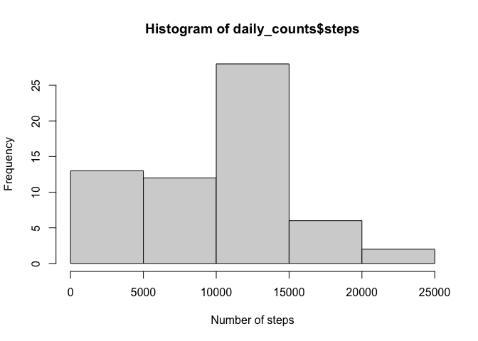
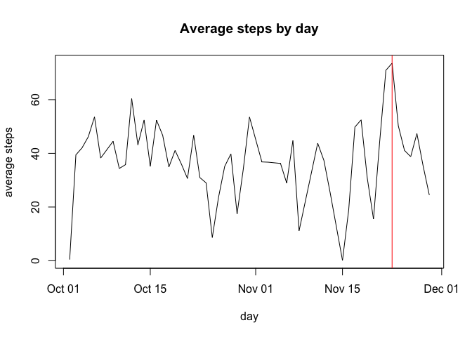
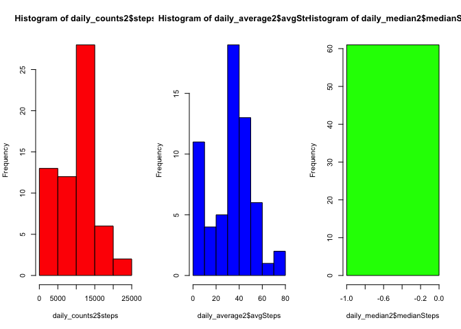
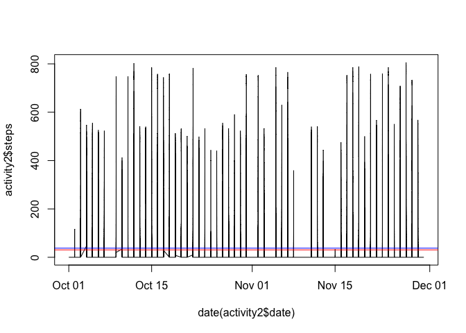

## Loading and preprocessing the data

```r
library(dplyr)
```

```
## 
## Attaching package: 'dplyr'
```

```
## The following objects are masked from 'package:stats':
## 
##     filter, lag
```

```
## The following objects are masked from 'package:base':
## 
##     intersect, setdiff, setequal, union
```

```r
library(lubridate)
```

```
## Loading required package: timechange
```

```
## 
## Attaching package: 'lubridate'
```

```
## The following objects are masked from 'package:base':
## 
##     date, intersect, setdiff, union
```

```r
if(!file.exists("activity.csv")){
        unzip("activity.zip")
}
activity <- read.csv("activity.csv")
```

## What is mean total number of steps taken per day?

```r
daily_counts <-  activity %>%
        mutate(date_by_day = date(date)) %>%
        group_by(date_by_day) %>%
        summarize(steps = sum(steps, na.rm = TRUE))
```
Histogram for steps per day

```r
hist(daily_counts$steps, xlab = "Number of steps")
```

<!-- -->

The mean of the daily steps is

```r
mean(daily_counts$steps)
```

```
## [1] 9354.23
```

The median of the daily steps is

```r
median(daily_counts$steps)
```

```
## [1] 10395
```

## What is the average daily activity pattern?

```r
daily_average <-  activity %>%
        mutate(date_by_day = date(date)) %>%
        group_by(date_by_day) %>%
        summarize(avgSteps = mean(steps, na.rm = TRUE))
daily_average <- daily_average[!is.na(daily_average$avgSteps),]
plot(daily_average$date_by_day, daily_average$avgSteps, main = "Average steps by day", xlab = "day", ylab = "average steps", type = "l")
abline(v=daily_average[daily_average$avgSteps == max(daily_average$avgSteps, na.rm = TRUE),"date_by_day"], col = "red")
```

<!-- -->

## Imputing missing values
The total missing values in the dataset are:

```r
sum(is.na(activity$steps))
```

```
## [1] 2304
```
Filling the missing values

```r
activity2 <- activity[, c(1, 2)]
activity2$steps <- ifelse(is.na(activity2$steps), 0, activity2$steps)
head(activity2)
```

```
##   steps       date
## 1     0 2012-10-01
## 2     0 2012-10-01
## 3     0 2012-10-01
## 4     0 2012-10-01
## 5     0 2012-10-01
## 6     0 2012-10-01
```

Calculating the total steps per day and compare with the mean and the median

```r
daily_counts2 <-  activity2 %>%
        mutate(date_by_day = date(date)) %>%
        group_by(date_by_day) %>%
        summarize(steps = sum(steps, na.rm = TRUE))

daily_average2 <-  activity2 %>%
        mutate(date_by_day = date(date)) %>%
        group_by(date_by_day) %>%
        summarize(avgSteps = mean(steps, na.rm = TRUE))

daily_median2 <-  activity2 %>%
        mutate(date_by_day = date(date)) %>%
        group_by(date_by_day) %>%
        summarize(medianSteps = median(steps, na.rm = TRUE))
par(mfrow = c(1,3))
hist(daily_counts2$steps, col = "red")
hist(daily_average2$avgSteps, col = "blue")
hist(daily_median2$medianSteps, col = "green")
```

<!-- -->


## Are there differences in activity patterns between weekdays and weekends?

```r
activity2$weekday <- ifelse(weekdays(date(activity2$date))=="Monday" | weekdays(date(activity2$date))=="Tuesday" | weekdays(date(activity2$date))=="Wednesday" | weekdays(date(activity2$date))=="Thursday" | weekdays(date(activity2$date))=="Friday", "weekday", "weekend")

average_weekday <- activity2 %>%
        group_by(weekday) %>%
        summarize(avgSteps = mean(steps, na.rm = TRUE))

plot(date(activity2$date), activity2$steps, type = "l")
abline(h=average_weekday$avgSteps[1], col = "red")
abline(h=average_weekday$avgSteps[2], col = "blue")
```

<!-- -->
